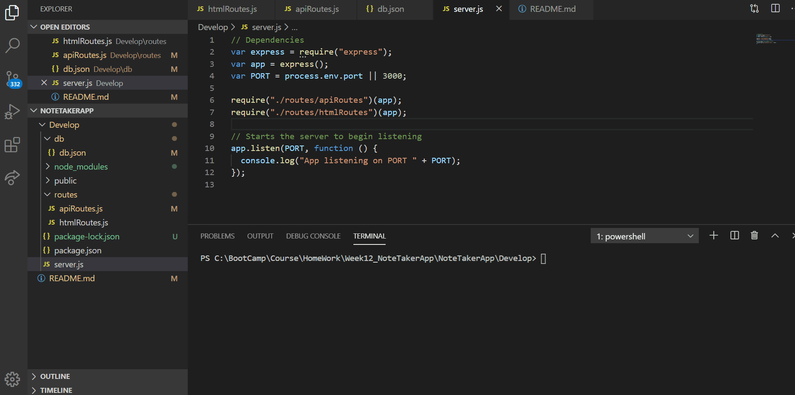

# Project Title: Note Taker

# Email Address

luta_atul@hotmail.com

Table of Contents:

[Description](#Description:)

[Installation](#Installation:)

[Usage](#Usage:)

[Licence](#Licence:)

[Contributing](#Contributing:)

[Screenshots](#Screenshots:)

[References](#References:)

# Description:

This application can be used to write, save, and delete notes. This application is using an express backend to save and retrieve note data from a JSON file. This application is for users that need to keep track of a lot of information, it's easy to forget or be unable to recall something important. Being able to take persistent notes allows users to have written information available when needed.

# Installation:

Navigate to following folder

https://github.com/atulsd/NoteTakerApp

Clone the Repo

To view the web pages go to the following link

https://atulsd.github.io/NoteTakerApp/

# Contributing

This is an open source project and is avaiable for anyone with a reference to it.

# Usage

This application is for writing, saving and deleting notes in the note taker.

# Licence

# Screenshots

# References:

Creat Routes using middleware: https://www.youtube.com/watch?v=iM_S4RczozU

Routing information: https://expressjs.com/en/guide/routing.html

Middleware: https://expressjs.com/en/resources/middleware/serve-index.html
